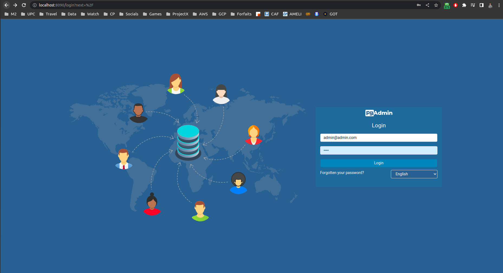
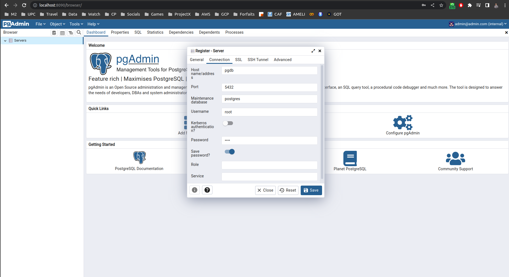
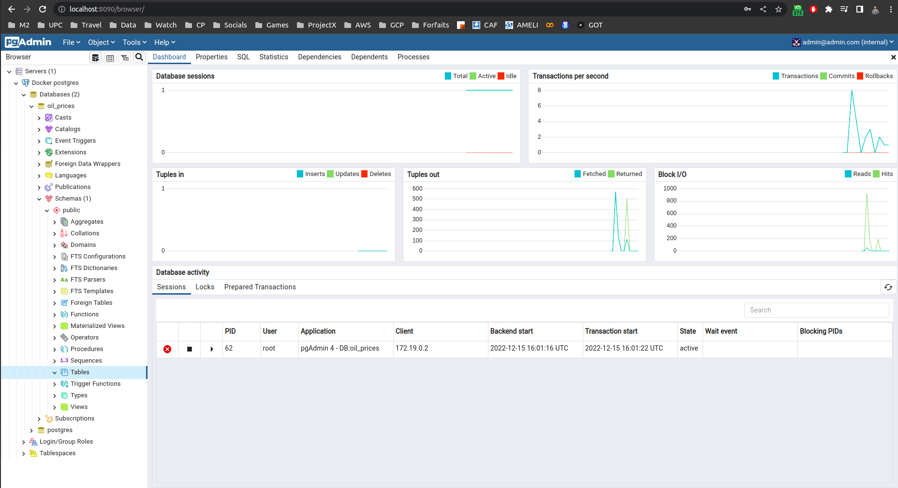
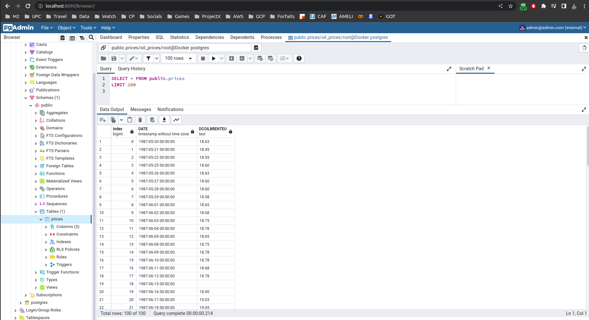

# Data Engineering Project using Git and Docker
What we are planning to work on is a project around time series prediction, mainly the prediction of oil prices.

## Git usage
We will be using Git and Github for version control, and collaborating with each other inside this repo

## Docker usage
We will have many containers responsible for different tasks and pipelines:
1. Data Fetching
2. Data Ingestion
3. Model Training (Different time steps for each training)

## Data Source
[Data](https://fred.stlouisfed.org/series/DCOILBRENTEU#0)

### Part 1 : Fetching data dynamically
Open a first terminal and run the following commands

```console
foo@bar:~$ cd data_fetching
foo@bar:~$ docker build -t data-fetch .
foo@bar:~$ docker run -it --name data-fetch data-fetch
```

Once inside the docker container
```console
root@id:~$ URL="shorturl.at/arJNS"
root@id:~$ python data_fetching.py --url=${URL}
```

Open a second terminal and run the following command

```console
foo@bar:~$ docker cp data-fetch:/app/raw_data.csv ../data/raw_data.csv
```

Now we have fetched our CSV file and it's stored in the directory data at the root of our repo

```console
root@id:~$ exit
```

### Part 2 : Ingesting data into Postgres
For this part, the idea is to avoid manually copying datasets from inside the container to the host in order to perform machine learning tasks, so we decided to build a small ETL flow that ingests data into a Postgres database that can be administrated using the pgAdmin software.

To create and run the Postgres db instance and pgAdmin we tried building separate images and running containers separately in the same network, it worked but it was also a chance for us to explore docker-compose which makes running multiple containers easier, we also used volumes to keep the configuration of last run of the container so we don't lose data after ingestion each time. (Check docker-compose.yaml file for further insights)

Open a first terminal, create a folder on the host and make sure you have the permissions on the folder to keep pgAdmin configuration persistent.

```console
foo@bar:~$ cd data_ingesting
foo@bar:~$ mkdir pgadmin_keep_state
foo@bar:~$ sudo chown 5050:5050 pgadmin_keep_state
foo@bar:~$ docker-compose up -d
```
This will run both containers together in deatched mode in the same network you should be able to see both logs of postgres and pgadmin in the terminal, you can also run a ```docker ps``` to see the two up and running containers.

Go to [pgAdmin](http://localhost:8090/) and register a new server to connect to postgres







After that let's run our data ingestion process, make sure you run in the same network as the two previous containers, you can also run a ```docker network ls``` to see the networks created by Docker, in all cases we specified a name for it in the compose file

```console
foo@bar:~$ docker build -t data-ingest .
foo@bar:~$ URL="shorturl.at/arJNS"
foo@bar:~$ docker run -it \
	--network=data-ingest-network \
	data-ingest \
    --user=root \
    --password=root \
    --host=pgdb \
    --port=5432 \
    --db=oil_prices \
    --table_name=prices \
    --url=${URL}
```

Now we have loaded our CSV data file into the Postgres database. Let's stop the containers and start them again to check for the availability of our data.
```console
root@id:~$ docker-compose down
root@id:~$ docker-compose up -d
```

Go to [pgAdmin](http://localhost:8090/) once again you should be able to see the following table



