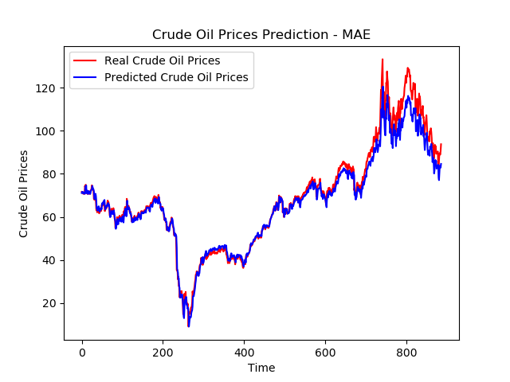
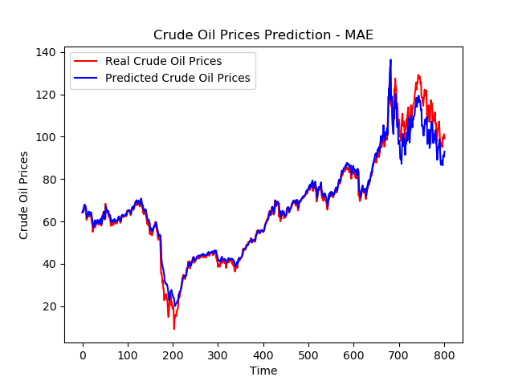

# Data Engineering Project using Git and Docker
What we are planning to work on is a project around time series prediction, mainly the prediction of oil prices.

## Git usage
We will be using Git and Github for version control, and collaborating with each other inside this repo

## Docker usage
We will have many containers responsible for different tasks and pipelines:
1. Data Fetching
2. Data Ingestion
3. Model Training (Different time steps for each training)

## Data Source
[Data](https://fred.stlouisfed.org/series/DCOILBRENTEU#0)

### Part 1 : Fetching data dynamically
Open a first terminal and run the following commands:

```console
foo@bar:~$ cd data_fetching
foo@bar:~$ docker build -t data-fetch .
foo@bar:~$ docker run -it --name data-fetch data-fetch
```

Once inside the docker container:
```console
root@id:~$ URL="shorturl.at/arJNS"
root@id:~$ python data_fetching.py --url=${URL}
```

Open a second terminal and run the following command:

```console
foo@bar:~$ docker cp data-fetch:/app/raw_data.csv ../data/raw_data.csv
```

Now we have fetched our CSV file and it's stored in the directory data at the root of our repo:

```console
root@id:~$ exit
```

### Part 2 : Ingesting data into Postgres
For this part, the idea is to avoid manually copying datasets from inside the container to the host in order to perform machine learning tasks, so we decided to build a small ETL flow that ingests data into a Postgres database that can be administrated using the pgAdmin software.

To create and run the Postgres db instance and pgAdmin we tried building separate images and running containers separately in the same network, it worked but it was also a chance for us to explore docker-compose which makes running multiple containers easier, we also used volumes to keep the configuration of last run of the container so we don't lose data after ingestion each time. (Check docker-compose.yaml file for further insights)

Open a first terminal, create a folder on the host and make sure you have the permissions on the folder to keep pgAdmin configuration persistent:

```console
foo@bar:~$ cd data_ingesting
foo@bar:~$ mkdir pgadmin_keep_state
foo@bar:~$ sudo chown 5050:5050 pgadmin_keep_state
foo@bar:~$ docker-compose up -d
```
This will run both containers together in deatched mode in the same network you should be able to see both logs of postgres and pgadmin in the terminal, you can also run a ```docker ps``` to see the two up and running containers.

Go to [pgAdmin](http://localhost:8090/) and register a new server to connect to postgres


After that let's run our data ingestion process, make sure you run in the same network as the two previous containers, you can also run a ```docker network ls``` to see the networks created by Docker, in all cases we specified a name for it in the compose file:

```console
foo@bar:~$ docker build -t data-ingest .
foo@bar:~$ URL="shorturl.at/arJNS"
foo@bar:~$ docker run -it \
	--network=data-ingest-network \
	data-ingest \
    --user=root \
    --password=root \
    --host=pgdb \
    --port=5432 \
    --db=oil_prices \
    --table_name=prices \
    --url=${URL}
```

Now we have loaded our CSV data file into the Postgres database. Let's stop the containers and start them again to check for the availability of our data:
```console
root@id:~$ docker-compose down
root@id:~$ docker-compose up -d
```

Go to [pgAdmin](http://localhost:8090/) once again you should be able to see the following table


### Part 3 : Training a time series model and dockerizing it
First we wrote the script for:
1. Reading the data and plotting it
2. Splitting data into train and test sets
3. Feature scaling and reshaping the train and test
4. Training the model locally
5. Doing the predictions on the test set and generating the plots and model

For the docker part we started by creating the directories into which we are going to export the trained model and prediction plots:
```console
foo@bar:~$ cd model_training
foo@bar:~$ cd mkdir model_from_container img_from_container
```

Then we created a requirements file to automate packages installations:
```console
pandas
numpy
matplotlib
scikit-learn
tensorflow
Keras
```

Create the Dockerfile:
```console
FROM python:3.7.2

WORKDIR /app

COPY requirements.txt requirements.txt 

RUN python -m pip install --upgrade pip
RUN pip install -r requirements.txt

COPY main.py main.py

ENTRYPOINT [ "bash" ]
```

We build and run the docker image:
```console
foo@bar:~$ docker build -t model-train .
foo@bar:~$ docker run -it --name model-train model-train
```

Once inside the docker container:
```console
root@id:~$ mkdir img models
root@id:~$ python main.py
```

Open a second terminal and run the following command:

```console
foo@bar:~$ docker cp model-train:/app/models/model_with_20ts.h5 ./model_from_container
foo@bar:~$ docker cp model-train:/app/img/pred_20_ts.png ./img_from_container
```

Plotting the initial data:


Results with 10, 20 and 30 timesteps:






### Part 4 : Training a time series model and deploying it using Flask and Docker
The code for training can be found in the train folder alongside the plots

The cfg folder contains the list of models we will train, we start by one which is teh fbprophet.

The models contain the pickled trained models.

The utils file contain a blackbox class that serves to instanciate a loaded model and use it for prediction in flask.

The templates folder contain all rendered templates of flask.

app.py is the file that has all the API routes and backend logic.

We created a requirements file to automate packages installations containing all versions this time:
```console
numpy==1.21.5
Flask==2.1.0
wheel==0.37.1
prophet==1.1.2
scikit-learn==1.0.2
openpyxl==3.0.10
pandas==1.4.4
```

Create the Dockerfile:
```console
FROM python:3.9.13

RUN mkdir /app
WORKDIR /app
COPY . /app

RUN python -m pip install --upgrade pip setuptools wheel
RUN python -m pip install -r requirements.txt

CMD ["python", "app.py"]
```

We create and inspect a volume then use it afterwards for file sharing between container and host.
```console
foo@bar:~$ docker volume create share
foo@bar:~$ docker volume inspect share
```

We build and run the docker image and mount it:
```console
foo@bar:~$ docker build -t flask-app .
foo@bar:~$ docker run -it --name=flask-app --mount source=share,destination=/app/share flask-app
```

After this we tagged the image so we can push it to docker hub.
Link is available in the [report](https://github.com/adnaneaabbar/oil-price-prediction/blob/master/Rapport_Projet_Data_Engineering.pdf).
